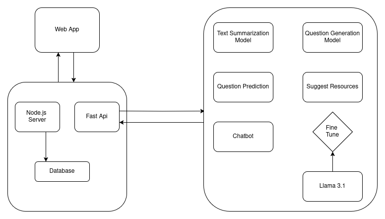
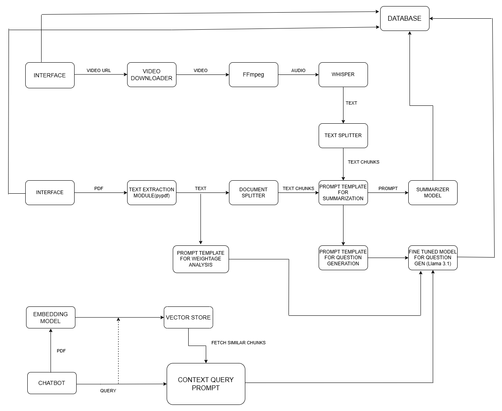
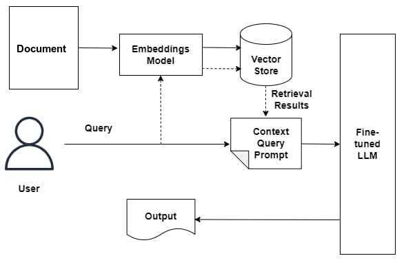
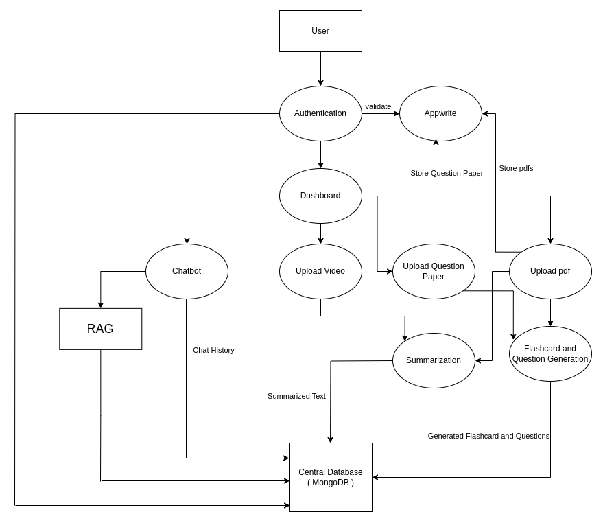

# EduArc : AI-Powered Learning and Assessment Tool
A comprehensive app that combines learning aids and performance assessment tools into a unified educational ecosystem built with React Native. Designed to support students in personalized learning, the app offers features such as intelligent text summarization, automated flashcard and quiz generation, a live chatbot for real-time academic assistance, and predictive analytics to highlight key exam topics — providing a holistic and adaptive solution to enhance retention, comprehension, and performance in academic settings.

## Features
- Summarize lengthy study materials into short, easy-to-understand notes.
- Generate flashcards automatically from uploaded notes or text.
- Create quizzes from documents to reinforce learning.
- Use a live AI chatbot to clear doubts in real time.
- Predict high-weightage topics using past exam data.
- Suggest additional resources to aid learning.

## Tech Stack
- **Frontend :** React Native
- **Backend :** Express.js, Flask
- **AI/ML Components :** Llama 3.1, Command-R
- **Database and Storage :** MongoDB, Chroma
- **Frameworks :** Unsloth
- **Other tools :** Appwrite, FFmpeg, LangChain, Firebase, Whisper, Google Colab

## Architecture
<div align="center">
<table border="0">
  <tr>
    <td align="center">
      <br/>
      <em>System Architecture</em>
    </td>
    <td align="center">
      <br/>
      <em>Detailed Architecture</em>
    </td>
  </tr>
  <tr>
    <td align="center">
      <br/>
      <em>RAG Architecture</em>
    </td>
    <td align="center">
      <br/>
      <em>Dataflow</em>
    </td>
  </tr>
</table>
</div>


## 📦 Installation & Setup

### Prerequisites

Make sure the following are installed:

- [Node.js](https://nodejs.org/) (LTS recommended)
- npm or yarn
- [Expo CLI](https://docs.expo.dev/get-started/installation/)
- Git
- Python 3.8+
- Android Studio or Xcode (for emulators)  
  *OR* install **Expo Go** on a physical Android/iOS device

---

### ✅ Frontend Setup (EduArc App)

1. **Clone the frontend repository**
   ```bash
   git clone https://github.com/your-username/eduarc-frontend.git
   cd eduarc-frontend
   ```

2. **Install Expo CLI globally**
   ```bash
   npm install -g expo-cli
   ```

3. **Install frontend dependencies**
   ```bash
   npm install
   # or
   yarn install
   ```

4. **Start the development server**
   ```bash
   expo start
   ```

   - Press `i` to run on iOS simulator (macOS only)
   - Press `a` to run on Android emulator
   - Or scan the QR code with **Expo Go** on your mobile device

5. **(Optional) Setup environment variables**
   ```bash
   touch .env
   ```

   Add the following to `.env`:
   ```
   API_URL=https://your-backend-url.com/api
   ```

---

### ⚙️ Backend Setup (Flask + Express)

1. **Clone the backend repository**
   ```bash
   git clone https://github.com/your-username/eduarc-backend.git
   cd eduarc-backend
   ```

2. **Set up Flask server**
   ```bash
   cd flask-server
   python -m venv venv
   source venv/bin/activate       # On Windows: venv\Scripts\activate
   pip install -r requirements.txt
   ```

3. **Set up Express server**
   ```bash
   cd ../express-server
   npm install
   ```

4. **Run both backend servers**

   - Start Flask server:
     ```bash
     cd flask-server
     flask run
     ```

   - Start Express server:
     ```bash
     cd ../express-server
     npm start
     ```

---


## System Architecture
- 


## UI Design


## Training Notebooks
- Topic Weightage Analysis : [Open in Google Colab](https://colab.research.google.com/drive/1RclTiAr8_MUMUVlun5CsPiwQixlGOF45?usp=sharing)
- Question Generation : [Open in Google Colab](https://colab.research.google.com/drive/1zZNdrRlQJtcBKQ_O30Gs4mvr24BKkSQe?usp=sharing)
